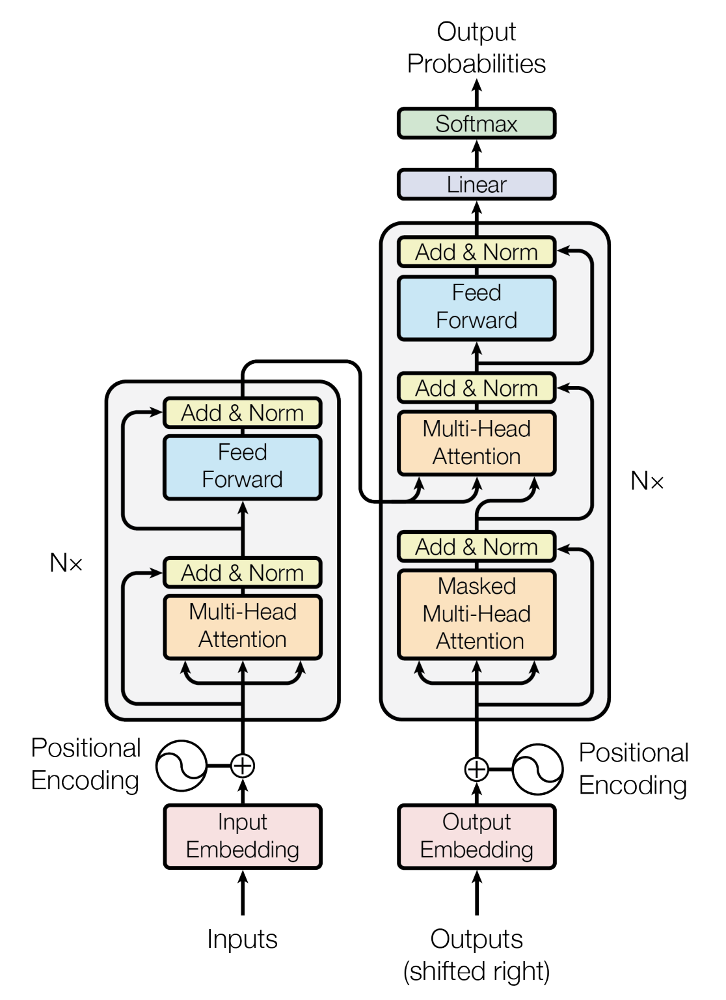

# deepiler

A neural-based decompiler using a Transformer model for decompilation tasks. 
* The model only supports mips assembly decompilation for now.
* The model has been trained on examples from `math.h` so it is not usable for now with other corpus of code.

## Intuition
In this project, we want to demonstrate **if Deep Learning and especially Transformer models can be applied to decompilation tasks**. 
Transformer models are used for common NLP tasks and is the state of the art in this field. 
We think that decompilation can be seen as a translation task, where we want to translate a low level programming language (PL) 
to a higher level programming language. For now, the model uses as low level PL the MIPS Assembly and as high level PL the C language.

## Usage

### Training
```
python3 decompile.py --train --model-path path_to_save
```

### Decompilation
```
python3 decompile.py --decompile path/to/asm-file.s --model-path path_to_save
```

### Architecture
The architecture used in this project is the same transformer used in the orginial paper *All you need is attention* with some improvements and 
adaptatations to be applied to the decompilation task.

<p></p>
